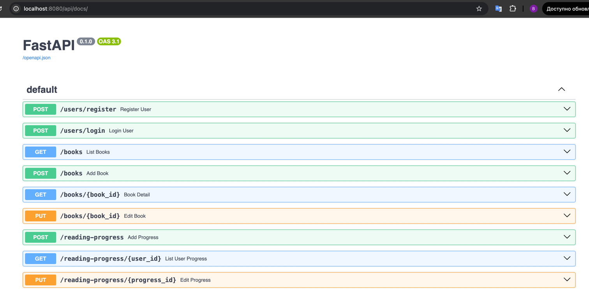
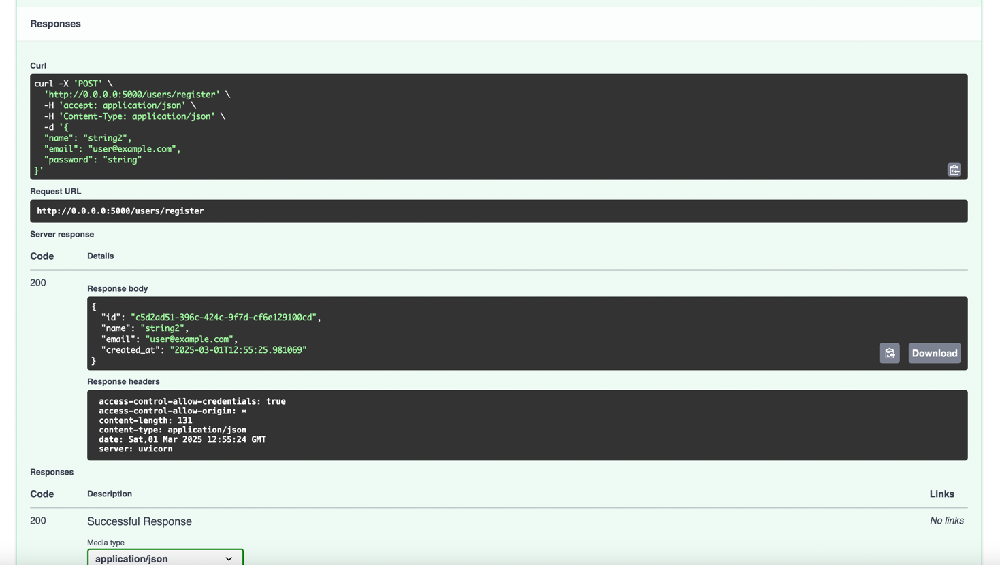
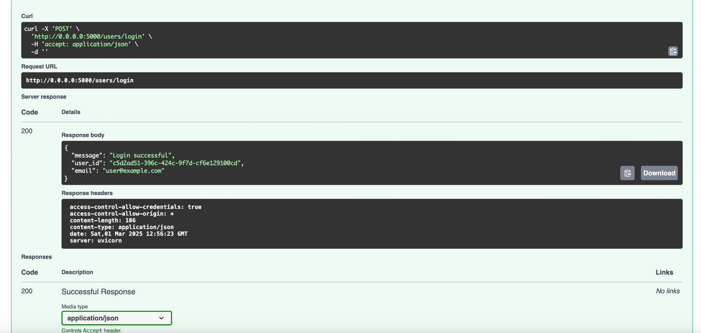
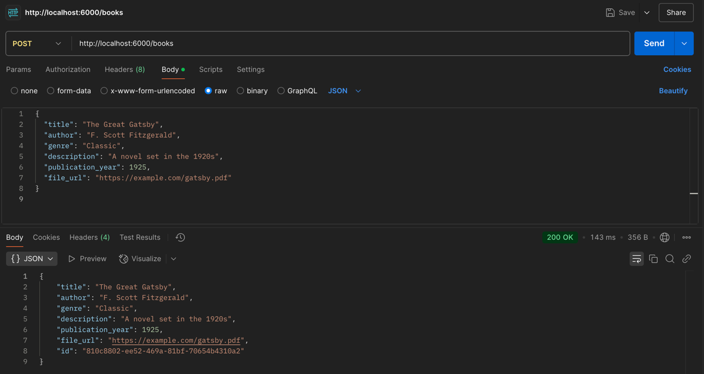
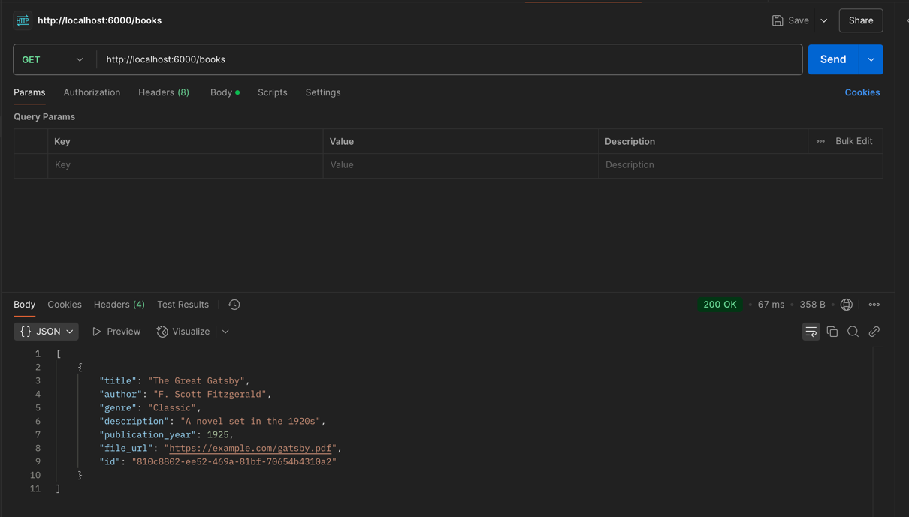
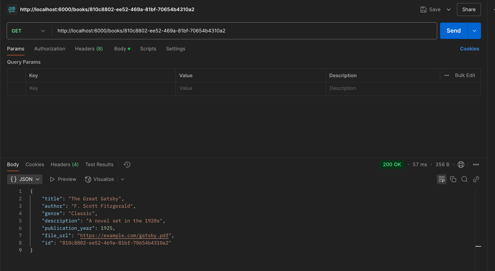
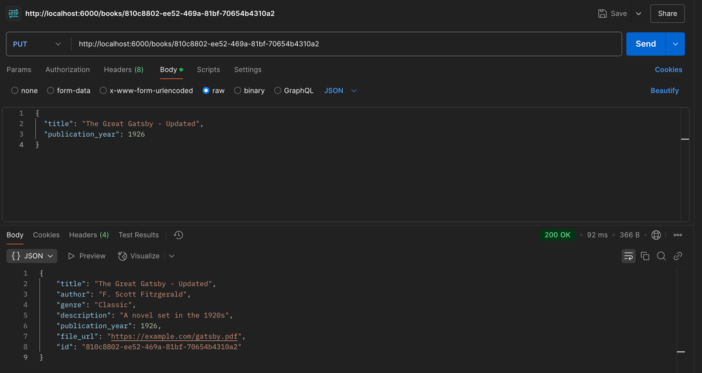
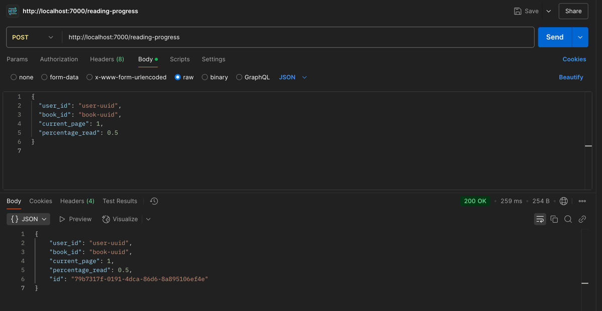
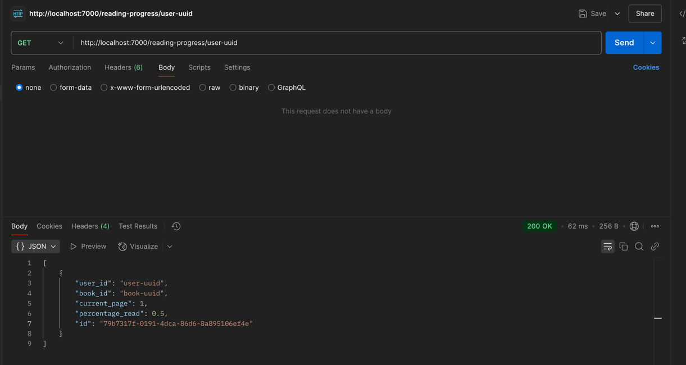
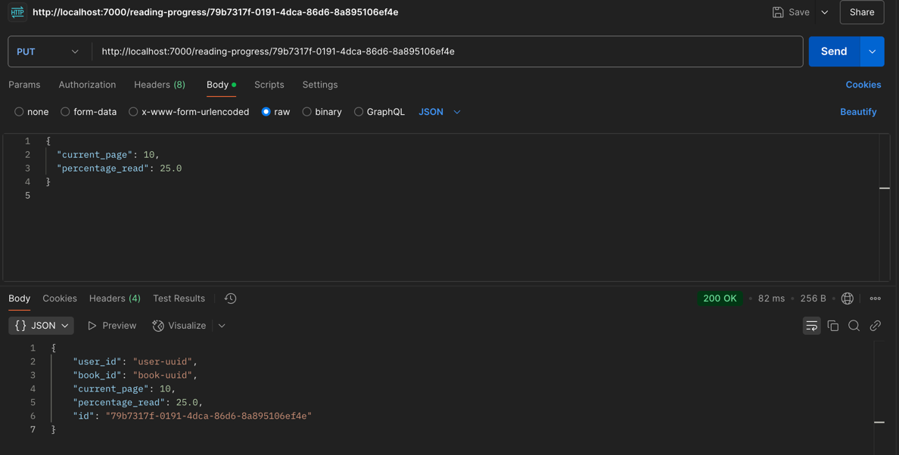

### Book service

Це платформа, де користувачі можуть переглядати каталог електронних книг, брати книги в оренду або додавати їх до списку для читання. Адміністратори можуть додавати нові книги та керувати їх доступністю. Платформа також може надавати рекомендації на основі історії читання користувача.
Проект базується на мікросервісах, які взаємодіють через меседж брокер для забезпечення асинхронної обробки запитів.

# Backend
## Instruction to UP

## API Gateway
По цьму урлу можна ознайомитись з документацією всіх ендпоїнтів системи - `http://localhost:8080/api/docs/`

## User service
* `POST /users/register` — реєстрація нового користувача
* `POST /users/login` — авторизація користувача

### Testing
* Тестування створення нового користувача через Swagger REST API

* Тестування логіну користувача через Swagger REST API

## Book service
* `POST /books` — додавання нової книги (для адміністратора)
* `GET /books` — отримання списку доступних книг
* `GET /books/:id` — отримання деталей книги
* `PUT /books/:id` — редагування метаданих книги (адміністратор)

### Testing
* Тестування створення нової книжки через POSTMAN

* Тестування отримання усіх книжок через POSTMAN

* Тестування отримання зазначенної книжки по ID через POSTMAN

* Тестування оновлення полів зазначенної книжки через POSTMAN

## Reading service
* `POST /reading-progress` — створення запису про прогрес читання
* `GET /reading-progress/:userId` — отримання списку книг, які читає користувач
* `PUT /reading-progress/:id` — оновлення прогресу читання

### Testing
* Тестування створення нового запису читання через POSTMAN

* Тестування отримання прогресу читання юзера POSTMAN

* Тестування оновлення читання через POSTMAN

# Frontend
## Instruction to UP
1. npm install
2. npm run dev
